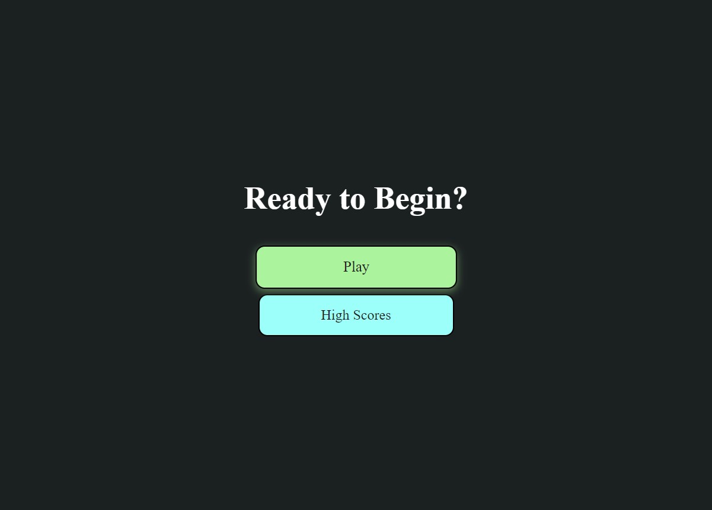

# JavaScript Coding Quiz

## Description
This project is a quiz pertaining to JavaScript. This project was created using HTML, CSS and JavaScript. It is a project pertaining to Web API's and the DOM, and how to utilize both within your website to save data over various instances. The quiz is designed to save the users name and score at the end of the quiz, and store them on the highscores.html page. 

## Screenshot
;

**Link to deployed application.**
https://mberti13.github.io/coding-quiz/